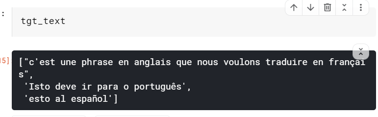

# Offline ways to translate

## hugging face

examples to try 
https://huggingface.co/transformers/examples.html

### MarianMT

https://huggingface.co/transformers/model_doc/marian.html

helpful blog but code breaks: 

https://towardsdatascience.com/build-your-own-machine-translation-service-with-transformers-d0709df0791b

### Transformers

https://huggingface.co/transformers/

